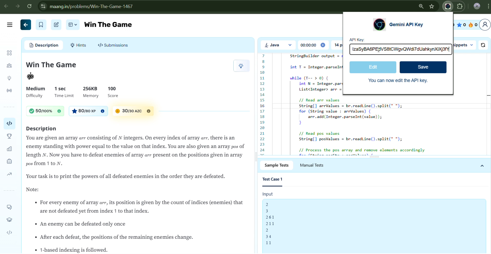
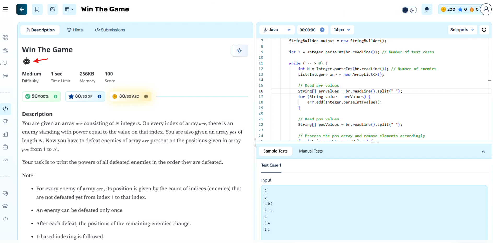
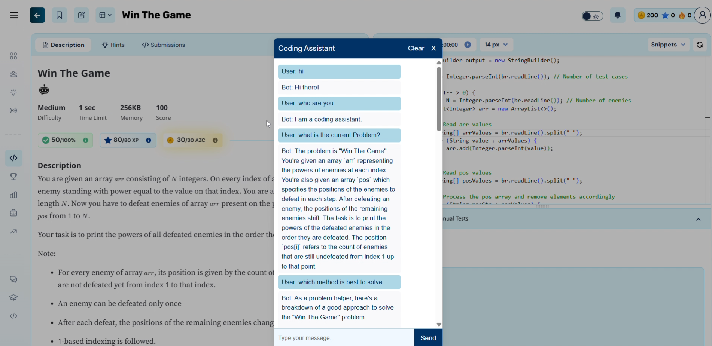

# AZ Assistant Chrome Extension

AZ Assistant is a Chrome extension designed to enhance the user experience on coding problem platforms by providing an AI-powered chatbot assistant directly on problem pages.

---

## Overview

AZ Assistant injects a user-friendly chat interface into supported problem pages, allowing users to:

- Retrieve and discuss saved code snippets.  
- Maintain a persistent conversation history per problem.  
- Receive intelligent guidance tailored to each coding challenge.  

---

## Features

- **Chat Overlay**: A modern dark-themed chat UI that appears on problem pages.  
- **Persistent Conversations**: Automatically stores chat history in `localStorage` for each problem.  
- **Retrieve Code Snippets**: Fetches previously saved code snippets based on the problem ID and language.  
- **Smart Chat Button**: Replaces the default “Ask Doubt” button with an **AZ Assistant** button.  
- **Clear Chat History**: Allows users to reset the conversation for a fresh start.  
- **Close Overlay**: Easily exit the chat interface when done.  
- **Auto-Detect Problem ID**: Parses the problem ID from the URL to load relevant context.  

---

## Installation

1. Clone or download the extension files to your local machine.  
2. Open Google Chrome and navigate to `chrome://extensions/`.  
3. Enable **Developer mode** (toggle at the top-right).  
4. Click **Load unpacked** and select the extension folder.  
5. The **AZ Assistant** button will now appear on supported coding problem pages.  

---

## How It Works

### Chat Button Injection

- The extension uses a `MutationObserver` to detect when a problem page loads.  
- It clones the existing “Ask Doubt” button, renames it to **AZ Assistant**, and appends an icon.  
- Clicking this button opens the chat overlay.  

### Chat Overlay UI

- **Header**: Shows the extension title with buttons to close the overlay or clear chat history.  
- **Body**: Displays past messages and new responses.  
- **Footer**: Contains an input field and send button for user messages.  

### Persistent Storage

- **Chat History**: Saved under `conversationHistory_<problemId>` in `localStorage`.  
- **Code Snippets**: Retrieved from keys formatted as `course_<userId>_<problemId>_<language>`.  
- **Editor Language**: Fetched from `localStorage` to present relevant code examples.  

---

## How to Use

1. Navigate to a supported problem page.  
2. Click the **AZ Assistant** button.  
3. Type your message or question in the input field and hit **Send**.  
4. Review AI-generated guidance and retrieve saved code snippets as needed.  
5. Click **Clear** to reset the conversation, or **X** to close the chat overlay.  

---

## Technologies Used

- **JavaScript**: Core logic for button injection, DOM manipulation, and API communication.  
- **localStorage**: For persisting chat history and code snippets.  
- **CSS**: Custom styles for the dark-themed chat UI.  
- **MutationObserver**: To monitor DOM changes and inject UI elements dynamically.  

---

## Future Enhancements

- **AI Responses**: Integrate with an AI service (e.g., Gemini API) for real-time problem-solving assistance.  
- **Code Execution**: Allow users to run snippets directly within the extension.  
- **User Authentication**: Sync conversations and snippets across devices.  
- **Theming Options**: Light/dark mode toggle and customizable UI skins.  

---

## Troubleshooting

- **Button Not Visible**: Refresh the page or confirm you’re on a supported URL.  
- **Storage Issues**: Ensure `localStorage` is enabled and has sufficient quota.  
- **Extension Errors**: Reload the extension from `chrome://extensions/` and check the console for logs.  

---

## License

This extension is open-source under the MIT License. Contributions and improvements are welcome! See the [LICENSE](LICENSE) file for details.  

---

## Sample Screenshots

<!-- Store your screenshots in a folder called `assets/` (or `images/`) at the root of your repo -->

  
  
  
  

*Figure: (1) API key entry via the extension’s options page, (2) AZ Assistant button injected on a problem page, (3) Chat assistant interface where you can communicate.*

---
**Demo Video**
)

